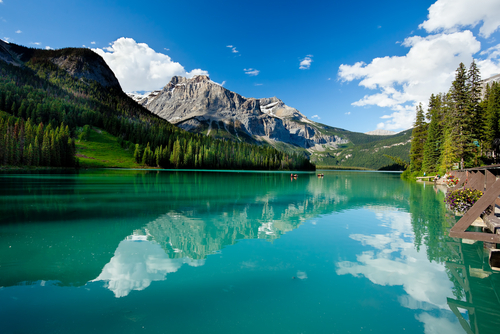
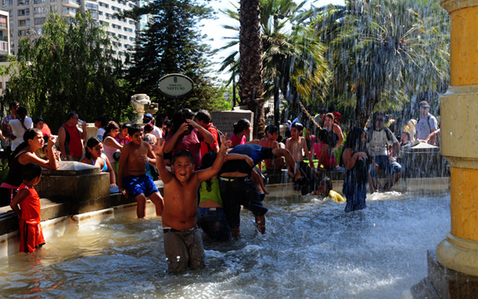

@title[Introduction]
<h2>Summer</h2>

Felipe Urra
---
<h2>What is Summer?</h2>

*  Hottest of the four seasons
*  Days are longer
*  Night are shorter
*  When it's summer in the northern hemisphere, it's winter in the southern hemisphere and viceversa

Source: [wikipedia](https://en.wikipedia.org/wiki/Summer) 
---
<h3>Summer in Canada</h3>

---
<h3>Summer in Canada</h3>

---
<h3>Summer in Canada</h3>

---
<h3>Summer in Chile</h3>

---
<h3>Summer in Chile</h3>

---
<h3>Summer in Chile</h3>

---
<h3>Summer in Chile</h3>

---
<h3>Bonus: Summer food</h3>

<h3>Favourite food:</h3>

Pastel de Choclo (corn pie)

---
<h3>Sources</h3>

* [www.kontrolmag.com](http://www.kontrolmag.com/wp-content/uploads/2017/06/summer.jpg)
* [enmicocinahoy.cl](https://www.enmicocinahoy.cl/pastel-de-choclo-chilean-corn-pie/)
* [www.travelmonitor.com.au](http://www.travelmonitor.com.au/category/news/todays-news/new-summer-air-service-chile-patagonia-starts-december/)
* [www.gettyimages.ca](https://www.gettyimages.ca/event/chile-experiences-its-largest-student-protest-in-three-decades-71104554?esource=SEO_GIS_CDN_Redirect#/santiago-chile-students-run-from-riot-police-during-clashes-30-may-picture-id71084875)
* [www.elciudadano.cl](https://www.elciudadano.cl/justicia/padre-emmelyn-canales-se-qurella-secuestro-antiguos-abusos-la-nina/02/12/)
* [misvacacionesya.com.ar](http://misvacacionesya.com.ar/usr/images/1358_Santiago_de_chile54.jpg)
* [https://www.whistler.com](https://www.whistler.com/activities/summer/)
* [nationalpost.com](http://nationalpost.com/travel/the-ten-most-affordable-canadian-cities-to-visit-this-summer)
* [studyabroad.com](https://www.studyabroad.com/in-canada/summer)